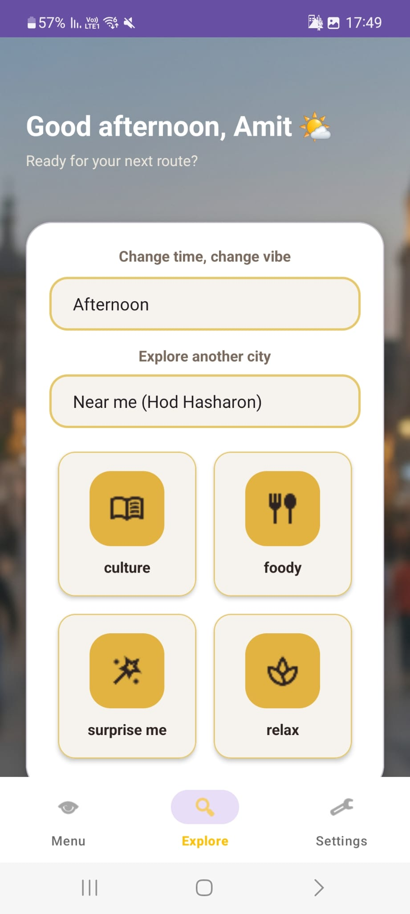
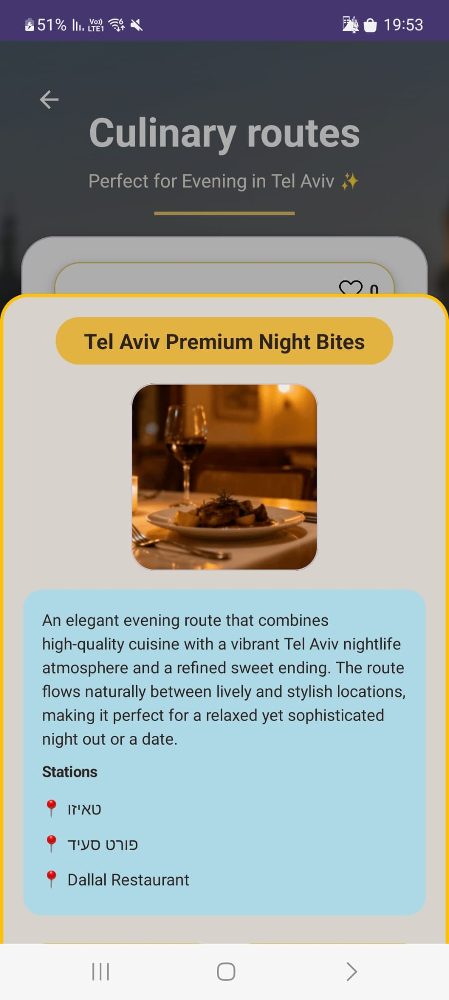
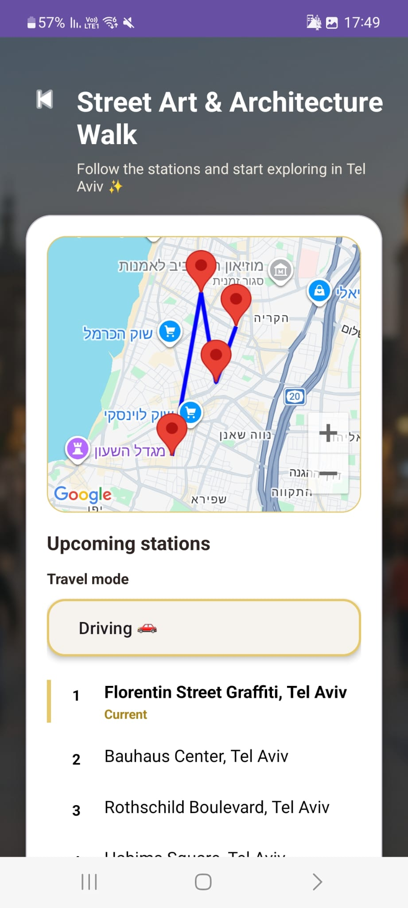

AROUND – Smart City Exploration App
#Overview
AROUND is an Android application that enables users to discover personalized urban routes based on their mood,
time of day, and location. The app offers short tours consisting of 2–4 stations, combining cultural,
culinary, and relaxing experiences to provide an engaging and convenient way to explore cities.

#Features
The app allows users to explore routes based on mood (Culture, Food, Relax, or Surprise) and filter them by
time of day (Morning, Afternoon, or Evening). By default, the app detects the user’s current time and location
and suggests relevant routes accordingly.

Users can also customize their search manually using Spinner components, allowing them to select a different city
or plan routes for a different time of day, regardless of their current location or time.

Each route includes a name, description, an ordered list of stations, and a single representative image.
Users can move between stations using a “Next Station” button, which updates the current station within the app.

The app includes a like system that allows users to express their preference for routes.
The number of likes is stored and updated in real time using Firebase.

In addition, users can create new routes by defining a name, description, stations, image, and other parameters.
An admin system is also implemented, allowing authorized users to approve or reject submitted routes.
The admin interface is only visible to users with appropriate permissions, while regular users are presented 
with Explore and Create options in the menu.

#Route Configuration

When creating a new route, users define several parameters:

Route name
Route description
City
Mood
Time of day (Morning / Afternoon / Evening)
Estimated duration
List of stations (2–4 stations)
A single representative image

#Navigation & Maps
The app integrates Google Maps to display route stations on an interactive map,
including visual connections between stations.
During usage,users can select their preferred travel mode via a Spinner (driving, public transport, walking, or cycling)
to receive a tailored route.

The “Next Station” button allows users to move between stations within the app.
To start actual navigation, users must press the “Navigate via Google Maps” button,
which opens navigation to the selected station in the Google Maps app.

#Architecture
The application is designed following Clean Architecture principles and is divided into three main layers:
UI (presentation), Domain (business logic), and Data (data access). This structure improves code modularity, readability,
and scalability.

#Tech Stack
Kotlin, Android SDK, Firebase (Authentication, Firestore, Storage), Google Maps SDK, Geocoding API, and Material Design components.
# Screenshots

## Home Screen

## Culinary Route

## Map Navigation

## Main Menu
.jpeg)
